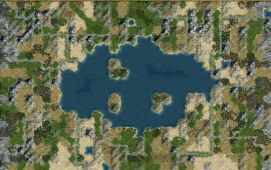

# Inland_Bridge.py
A Civilization IV mapscript based on Inland_Sea.py.
Features a center bridge splitting the sea into two, as well as several multiplayer-friendly customizations.




# Features
## Map Options
- Climate Details: Default Inland Sea or Natural.
- Hemisphere Option: Both hemispheres or a single hemisphere.
- Axial Tilt: Disabled, 90 degrees, or 45 degrees.
- World Wrap: Flat, Wrap X, or Wrap X & Y.
- Geography: Two Seas, Infinity, Hourglass, Two Shores (E-W), Two Shores (N-S), or Inland Sea.
- Islands: Disabled, Tiny Islands, or Clumped Islands.
- Two-tile Coasts: Enabled or disabled. Enabled expands coastlines to two tiles where possible.
- Team Start: Start teams together or disable custom team starts.
- Teamer Resource Balancing: Disabled or enabled. Enabled balances resources within assigned team regions.
- Debug Signs: Disabled or enabled for custom placement signs.
- Land Food Across Map: Disabled, or minimum Poisson spacing of 3, 4, or 5 tiles.
- Land Food on Starts: Disabled, or ensure at least 1, 2, or 3 land food bonuses in each starting BFC.
- Reveal Start Area Radius: Disabled, or reveal a radius of 2, 3, or 4 around each start.
- Strategic Resources Near Starts: Disabled, ensure Iron plus Copper or Horse, or ensure Iron, Copper, and Horse.

# Instructions
1. Download Inland_Bridge.py from the latest [release.](https://github.com/AineiasStymphalios/Inland_Bridge.py/releases)

2. Add Inland_Bridge.py to:
- CD version:
```
C:\Program Files\Firaxis Games\Civilization 4\Beyond the Sword\PublicMaps
```

- Steam version:
```
C:\Program Files (x86)\Steam\steamapps\common\Sid Meier's Civilization IV Beyond the Sword\Beyond the Sword\PublicMaps
```
3. Load Civ4. Select Central_Plains through *PLAY NOW* or *CUSTOM GAME.*


## Version support
This mapscript supports Civ4 Beyond the Sword, Warlords, and Vanilla.

## Mod support
This mapscript should work with most vanilla-like mods (e.g. BUG, BUFFY, AdvCiv ...).
